

  

<h1 align="center">ResQShare</h1>

Android app that helps people give away spare food and essentials to others nearby who need them.
Donors (people, restaurants, shops) post their surplus, and recipients and organizations nearby pick it up.
Distribution, listings and impact estimates are handled by AI.

<table align="center">
  <tr>
    <td align="center">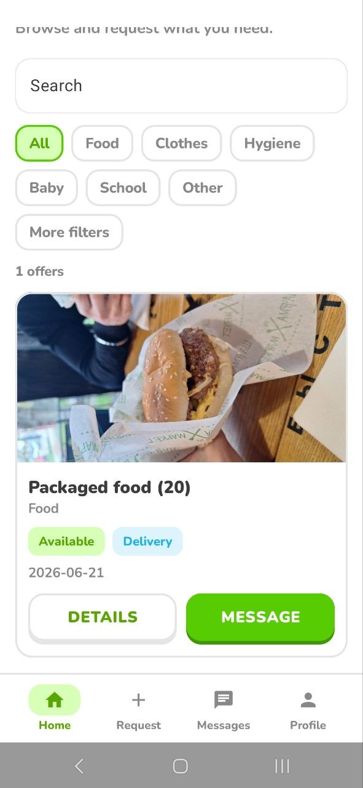 <b>Offers feed</b></td>
    <td align="center">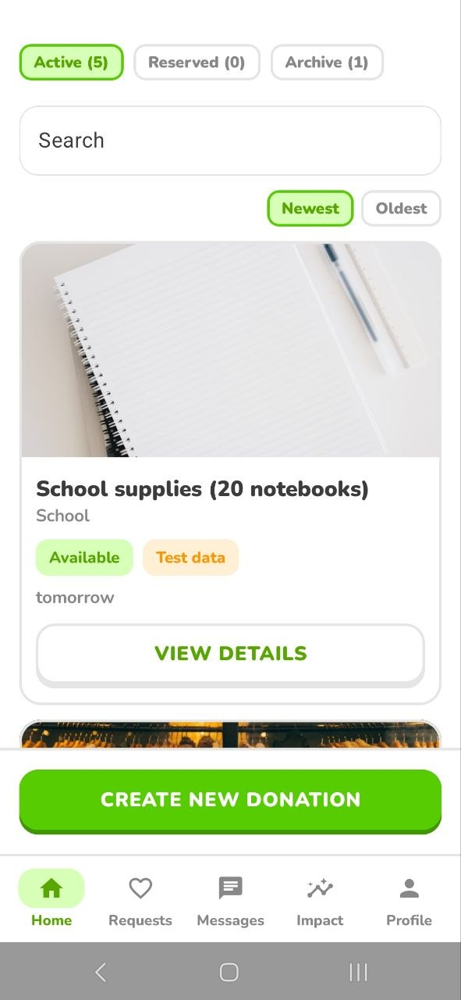 <b>Donor home</b></td>
    <td align="center">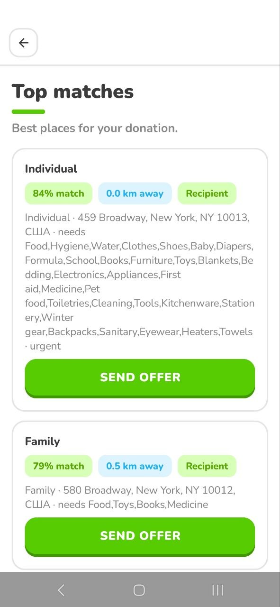 <b>AI matches</b></td>
  </tr>
</table>

## Dowland App
https://github.com/VLAADOS1/ResQShare-AI/releases/tag/App

## Demo

Video on YouTube: https://youtu.be/9-mbBZgp2Lw

## What it is and why

Restaurants, hotels and shops throw out a lot of food and goods at the end of the day, and regular people throw out things they no longer need. Meanwhile, people who could use those things live right nearby.

## Roles

- **Donor** - gives away spare food and items (a person, a restaurant, a shop).
- **Recipient** - takes what they need and posts their own requests.

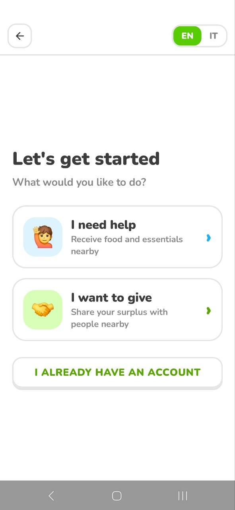 <b>Choose your role</b>

## AI in the app

### Smart distribution
AI decides who a donation should go to, instead of just showing the closest people. It takes into account distance, the recipient's real needs, dietary limits, urgency, family size and perishability. Perishable and prepared food is routed to organizations rather than individuals.

 <b>Ranked matches with a reason for each</b>

### Photo autofill
The donor adds a photo of the item, and AI figures out the category, quantity, condition and description on its own. The fields fill in automatically, you just check them.

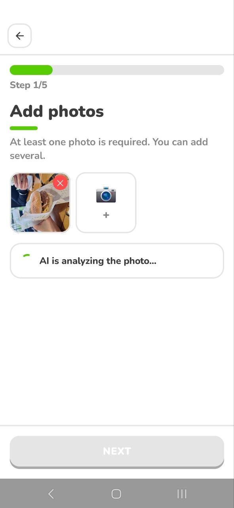 <b>AI reads the photo and fills the form</b>

### Listing generation
AI writes a clean listing for the donor, so there is almost nothing to type by hand. The text can be edited before publishing.

### Safety check
AI assesses the safety status and risk level of an item, builds a checklist for the donor to confirm, and suggests who the item is best given to.

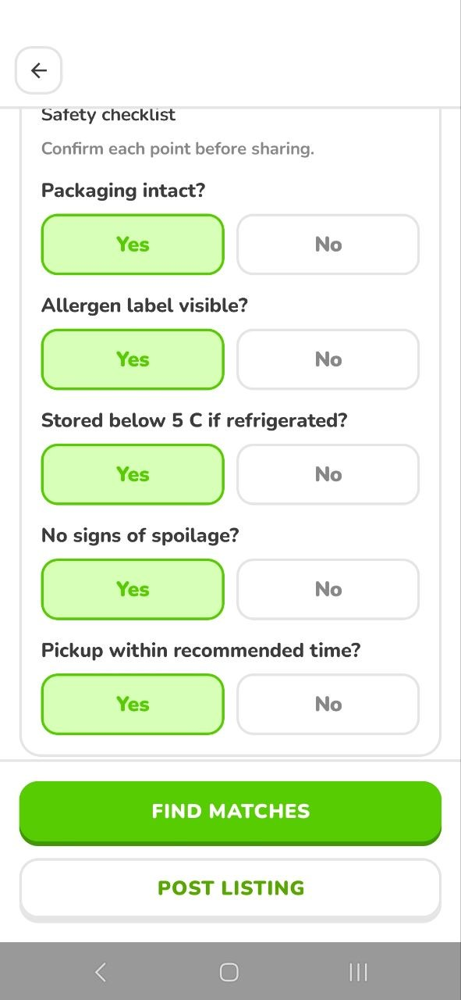 <b>AI safety checklist</b>

### Impact estimate
After a completed donation, AI estimates the real benefit: how many meals, how many kilograms rescued, CO2 avoided and people helped. These numbers go into your personal stats and achievements.

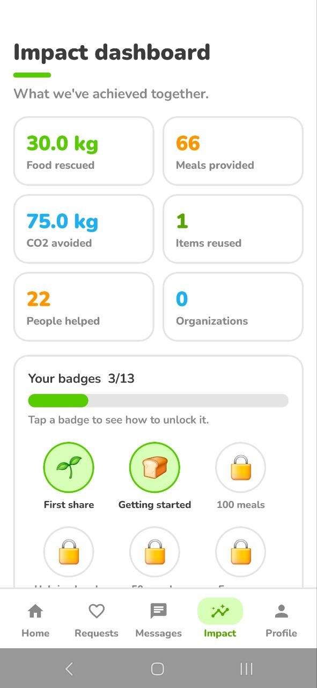 <b>Impact dashboard and badges</b>

> If AI is temporarily unavailable, the app does not break: it switches to a built-in heuristic mode, and all screens keep working.

## Other features

- **Offers feed** - the recipient's main screen with available donations nearby.
- **Offer page** - a donation page with donor info and a way to get in touch.
- **Requests near you** - a place for donors to see what people around them need.
- **My requests** - the recipient's own requests and managing them.
- **Chat** - messaging between people to arrange the handover.
- **Achievements** - a reward system that motivates helping more often.
- **Profile and admin panel** - personal account and platform management.

<table align="center">
  <tr>
    <td align="center">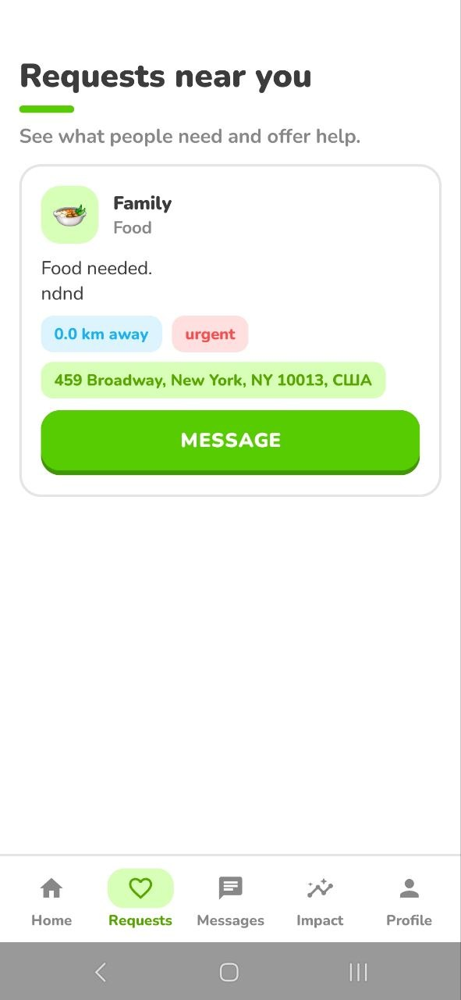 <b>Requests near you</b></td>
    <td align="center">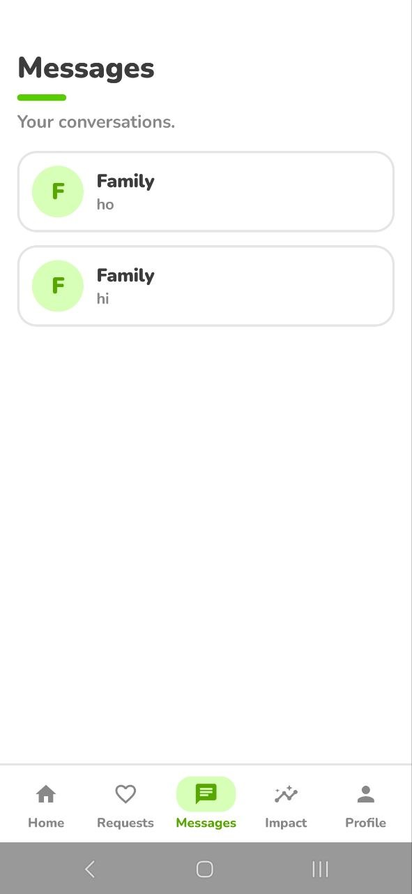 <b>Chat</b></td>
  </tr>
  <tr>
    <td align="center">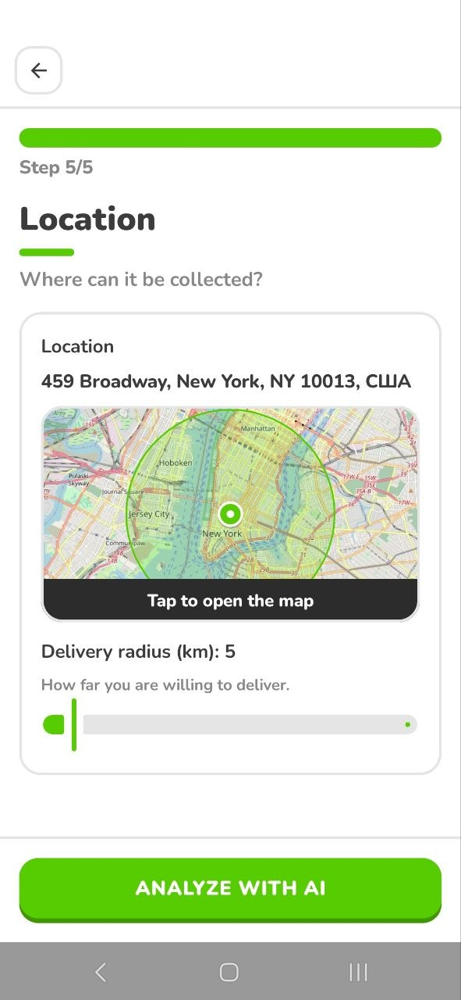 <b>Pick a point on the map</b></td>
    <td align="center">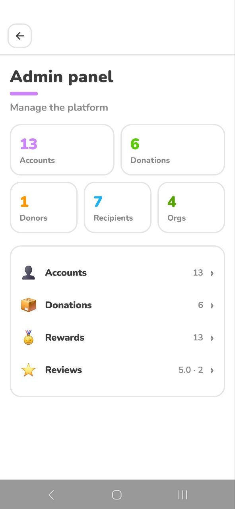 <b>Admin panel</b></td>
  </tr>
</table>

## Tech

- **App:** Kotlin, Jetpack Compose
- **Backend:** Java, Spring Boot, REST API, H2 database
- **AI:** ChatGPT 5.4 via the Replicate API
- **Hosting:** Docker on a Hetzner server, exposed through Cloudflare

## Install

1. Download `ResQShare.apk` from Releases.
2. Open the file on Android.

The server is already up and configured, so everything works right after install.
